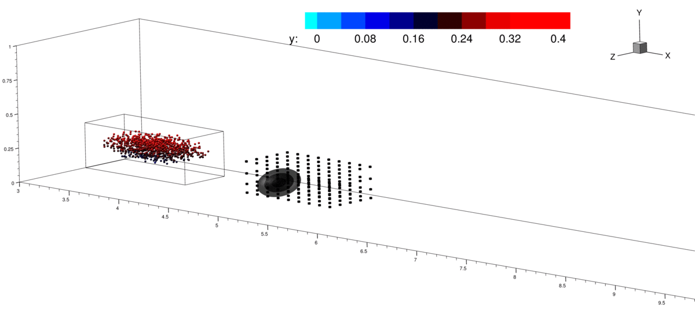

# MPC of LSMS
Code developed for the paper *"Model predictive control of coherent structures in wall-bounded flows"* by Alex Tsolovikos, Saikishan Suryanarayanan, Efstathios Bakolas, and David Goldstein. Paper under review in AIAA Journal.

### Abstract:

In this work, a novel flow control strategy involving steering large scale motions (LSMs) in a turbulent boundary layer is proposed. LSMs contain a significant fraction of the turbulent kinetic energy and selectively steering such volumes toward or away from the wall can lead to appreciable performance gains. This paper proposes a model predictive control algorithm for steering fluid volumes, developed as a first step toward implementing this strategy.The testbed is a direct numerical simulation (DNS) of a laminar boundary layer, where a Gaussian-distributed force field applied in a region of the flow directly above the wall is used as the actuator.A reduced-order linear model of the wall-normal velocity dynamics on a grid covering the neighborhood of the actuator - the control grid - is derived using sparsity-promoting dynamic mode decomposition with control (DMDcsp).The spatial evolution of a target volume is probabilistically described by a Gaussian mixture model propagated using the Taylor's hypothesis. The identified linear model is then required to track a reference output that creates negative wall-normal velocity along the predicted trajectory passing through the control grid. To that end, the control design is formulated as an output tracking optimal control problem with input constraints in discrete time, which is reduced to an equivalent quadratic program with linear constraints. The control problem is formulated under the model predictive control framework as a quadratic program that is solved at each time step as new targets are taken into account on the fly, yielding an input signal that effectively drives the target volumes toward the wall while avoiding excessive actuation.The effectiveness of the control scheme is demonstrated for both passive volumes represented by tracer particles as well as volumes containing sythentically generated LSMs with high vorticity fluctuations.

### Example Results:

- Moving fluid volumes towards the wall:

